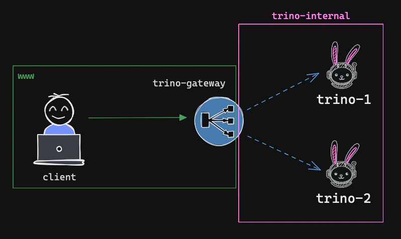
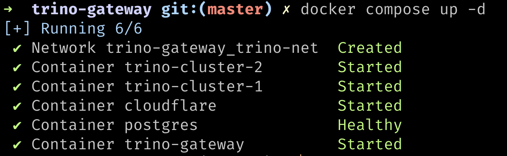
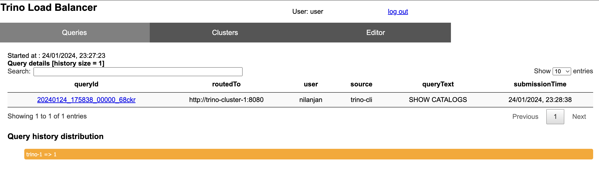
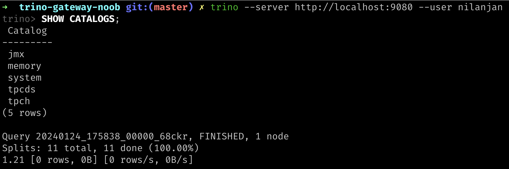

## Trino Gateway (by Trino) Integration

This repository contains a minimal docker compose setup to run Trino Gateway (by Trino) with Trino.

### Considerations

- I am using the **Version 4** of Trino Gateway (by Trino) which is the latest version at the time of writing this README.
- During the setup, I am following the instructions from the [Trino Gateway (by Trino) documentation](https://github.com/trinodb/trino-gateway/blob/main/docs/quickstart.md).

### Acknowledgements

- Trino Gateway Introdution on Trino Summit 2023. [YouTube](https://youtu.be/2qwBcKmQSn0)
- Trino Gateway (by Trino) documentation. [GitHub](https://github.com/trinodb/trino-gateway)

### Architecture (Docker Compose)



### Running Trino Gateway Locally

#### Running with Docker Compose

```
docker-compose up -d
```



#### Add Trino Cluster to Trino Gateway

```bash
./add-trino-cluster.sh
```

#### Check Trino Gateway UI

You can access Trino Gateway UI at http://localhost:9081



#### Executing Query with Trino CLI

Connect to Trino Gateway with Trino CLI

```bash
trino --server http://localhost:9080 --user nilanjan
```



---

Made with ❤️ by [nil1729](https://github.com/nil1729)
